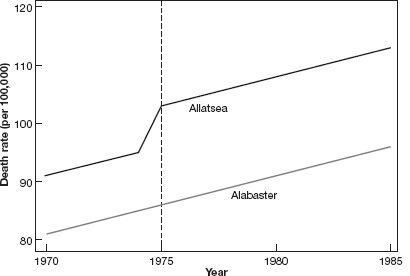

::: {.cell}

:::


# Diferencia en diferencias 

- La estrategia de diferencia en diferencias especifica las condiciones bajo las cuales es posible identificar el efecto del tratamiento al comparar unidades tratadas y no tratadas, cuando se dispone de información antes y después de la intervención

- Esta estrategia es ampliamente utilizada para analizar el efecto de leyes y políticas que afectan a un grupo de individuos al mismo tiempo

- Además, constituye el fundamento para otro de los métodos en donde la investigación actual es muy activa, el control sintético


## Introducción


:::: {.columns}

::: {.column width="50%"}
- Angrist & Pischke (2014) describen lo sucedido con el sector bancario en Mississippi durante la Gran Depresión

- En EUA, la FED tiene 12 bancos regionales y cada uno tiene autonomía para tomar ciertas decisiones de política monetaria

- En particular, Mississippi tiene una parte del estado bajo el mando del distrito 6 (Atlanta) y la otra mitad en el distrito 8 (San Luis)
:::

::: {.column width="50%"}


::: {.cell}
::: {.cell-output-display}

:::
:::


:::

::::


## Diferencia en diferencias


- Como respuesta a las corridas bancarias que caracterizaron la crisis de 1929, los bancos comerciales en Mississippi se vieron expuestos a dos políticas distintas

$$
T=
\begin{cases}
1\quad\quad \text{proveer liquidez adicional (distrito 6)} \\
0\quad\quad \text{dar igual o menos liquidez (distrito 8)} \\
\end{cases}
$$


- Si estamos interesados en la cantidad de bancos que sobrevivieron y decir algo sobre qué política es más efectiva, ¿qué podemos hacer?

- Una primera respuesta sería contar la diferencia después de la crisis:

| Distrito 8 | Distrito 6 | Diferencia |
|:---:|:---:|:---:|
| $T=0$ | $T=1$ | |
| 132 bancos | 121 bancos | 11 bancos


- Pareciera que la política de proveer liquidez, *easy money*, **causó** que quebraran más bancos

- Sin embargo, esta comparación claramente ignora las condiciones iniciales


## Representación gráfica

- Gráficamente observamos


::: {.cell output-location='column'}

```{.r .cell-code  code-line-numbers="40"}
banks<-read_csv("banks_mm.csv",
                       locale = locale(encoding = "latin1"))
banks <- banks %>%
  filter(month(date) == 7L,
         mday(date) == 1L) %>%
  mutate(year = year(date)) %>%
  select(year,
         matches("bi[ob][68]")) %>% 
  select(year,bib6,bib8) %>% 
  gather(distrito,banks,bib6:bib8) %>% 
  mutate(treatment=ifelse(distrito=="bib6",1,0)) %>% 
  mutate(post=ifelse(year>=1931,1,0))

banks %>% 
  mutate(banks=ifelse(year==1930 | year==1931,banks,NA)) %>% 
  filter(year <= 1932) %>% 
  ggplot(aes(x=year, y=banks, color=distrito)) +
  geom_line(size=2) +
  scale_y_continuous(limits=c(100,180))
```

::: {.cell-output-display}
{width=960}
:::
:::


## Representación gráfica

- Del distrito 8 (no tratado) podemos obtener la pendiente:

$$m_{NT}=\frac{Y_{8,post}-Y_{8,pre}}{X_{8,post}-X_{8,pre}}=\frac{132-165}{1931-1930}=-33$$

- Y entonces, podemos encontrar cuál hubiera sido el número de bancos en el distrio 6 (tratado) si hubiera seguido la pendiente del distrito 8:

$$m_T=\frac{\tilde{Y}_{6,post}-Y_{6,pre}}{X_{6,post}-X_{6,pre}}=\frac{\tilde{Y}_{6,post}-135}{1931-1930}=-33$$
- Por tanto, $\tilde{Y}_{6,post}=102$ es el número de bancos que el distrito 6 hubiera tenido si hubiera seguido una tendencia paralela a la del distrito 8


## Representación gráfica

- Podemos contruir el contrafactual para el distrito 6 observando la pendiente del distrito 8


::: {.cell output-location='column'}

```{.r .cell-code}
banks_contrafactual <- banks %>%
    mutate(banks=ifelse(year==1930 | year==1931,banks,NA)) %>% 
  filter(year <= 1932) %>% 
  mutate(tipo="observado")
  
d6_contrafactual <- banks_contrafactual %>% 
  filter(distrito=="bib6") %>% 
  mutate(banks=ifelse(year==1931,102,banks),
         tipo="contrafactual")

banks_contrafactual <- rbind(banks_contrafactual,d6_contrafactual)

dd_grafica <- banks_contrafactual %>% 
  ggplot(aes(x=year, y=banks, color=distrito, linetype=tipo))+
  geom_line(size=2) +
  scale_linetype_manual(values=c("dashed", "solid")) +
  scale_y_continuous(limits=c(100,180)) 


dd_grafica
```

::: {.cell-output-display}
{width=960}
:::
:::


## Diferencia en diferencias

- Podemos dar así una primera definición de lo que es la diferencia en diferencias del número de bancos que sobrevivieron a la Gran Depresión en Mississippi

$$
\begin{aligned}
\delta_{DID}&=(Y_{6,post}-Y_{6,pre})-(Y_{8,post}-Y_{8,pre}) \\
&=(Y_{6,1931}-Y_{6,1930})-(Y_{8,1931}-Y_{8,1930}) \\
&=(121-135)-(132-165) \\
&=-14+33 = 19
\end{aligned}
$$

- El estimador de DID toma en cuenta las diferencias inciales

- En este caso, el distrito 8 ya tenía más bancos abiertos que el 6 antes de la crisis

- DID construye un contrafactual para las unidades tratadas usando la pendiente de las unidades no tratadas


## Diferencia en diferencias

- El supuesto fundamental es el de **tendencias comunes**, es decir, que en ausencia del tratamiento, el grupo de tratamiento se hubiera comportado igual al grupo de control

- Si hay varios puntos pre intervención, el supuesto de tendencias comunes puede probarse empíricamente


## Regresión en DID

- El método puede generalizarse a más periodos de tiempo 

- Aquí, una regresión nos permite identificar el efecto del tratamiento

- Tenemos datos sobre el número de bancos en cada distrito en cada año (1929-1934)

$$y_{dt}=\alpha+\beta T_d+\gamma POST_t + \delta_{r,DID}(T_d\times POST_t)+e_{dt}$$
- $T_d$ es una dummy para los distritos tratados (distrito 6 en este caso)
  
  - Les llamamos **efectos fijos individuales** y sirven para controlar diferencias entre distritos que no cambian en el tiempo
  
- $POST_t$ es una dummy para los periodos post tratamiento (1931 en adelante)

- Al término $T_d\times POST_t$ se le conoce como el **término de interacción**, que es una dummy igual a 1 para los distritos tratados en los años post intervención

- $\delta_{r,DID}$ es el estimador de DID del efecto del tratamiento


## Regresión en DID


- Usemos los datos del archivo [banks_mm.csv](banks_mm.csv) que se utilizan en el libro

- Es una forma muy básica de datos en panel: cada fila representa un distrito en un periodo de tiempo

- Podemos identificar si cada fila pertenece a un distrito tratado o no o a un periodo posterior a al tratamiento o no


::: {.cell}

```{.r .cell-code}
banks
```

::: {.cell-output .cell-output-stdout}

```
# A tibble: 12 × 5
    year distrito banks treatment  post
   <dbl> <chr>    <dbl>     <dbl> <dbl>
 1  1929 bib6       141         1     0
 2  1930 bib6       135         1     0
 3  1931 bib6       121         1     1
 4  1932 bib6       113         1     1
 5  1933 bib6       102         1     1
 6  1934 bib6       102         1     1
 7  1929 bib8       169         0     0
 8  1930 bib8       165         0     0
 9  1931 bib8       132         0     1
10  1932 bib8       120         0     1
11  1933 bib8       111         0     1
12  1934 bib8       109         0     1
```


:::
:::


## Regresión en DID

- Estimemos la regresión que acabamos de motivar usando todos los periodos en el panel


::: {.cell}

```{.r .cell-code}
did_bank <- lm(banks ~ treatment + post+ treatment*post,
               data=banks)

summary(did_bank)
```

::: {.cell-output .cell-output-stdout}

```

Call:
lm(formula = banks ~ treatment + post + treatment * post, data = banks)

Residuals:
   Min     1Q Median     3Q    Max 
-9.000 -7.125  0.000  3.125 14.000 

Coefficients:
               Estimate Std. Error t value Pr(>|t|)    
(Intercept)     167.000      6.190  26.980 3.83e-09 ***
treatment       -29.000      8.754  -3.313 0.010652 *  
post            -49.000      7.581  -6.464 0.000195 ***
treatment:post   20.500     10.721   1.912 0.092224 .  
---
Signif. codes:  0 '***' 0.001 '**' 0.01 '*' 0.05 '.' 0.1 ' ' 1

Residual standard error: 8.754 on 8 degrees of freedom
Multiple R-squared:  0.8906,	Adjusted R-squared:  0.8496 
F-statistic: 21.71 on 3 and 8 DF,  p-value: 0.0003369
```


:::
:::


## Regresión en DID

- Noten que si solo usamos dos años, obtenemos exactamente lo que obtendríamos haciendo las diferencias *a mano*

$$\delta_{DiD}=(Y_{6,1931}-Y_{6,1930})-(Y_{8,1931}-Y_{8,1930})=19$$


::: {.cell}

```{.r .cell-code}
did_bank2 <- lm(banks ~ treatment + post+ treatment*post,
               data=filter(banks,year==1930 | year==1931))


summary(did_bank2)
```

::: {.cell-output .cell-output-stdout}

```

Call:
lm(formula = banks ~ treatment + post + treatment * post, data = filter(banks, 
    year == 1930 | year == 1931))

Residuals:
ALL 4 residuals are 0: no residual degrees of freedom!

Coefficients:
               Estimate Std. Error t value Pr(>|t|)
(Intercept)         165        NaN     NaN      NaN
treatment           -30        NaN     NaN      NaN
post                -33        NaN     NaN      NaN
treatment:post       19        NaN     NaN      NaN

Residual standard error: NaN on 0 degrees of freedom
Multiple R-squared:      1,	Adjusted R-squared:    NaN 
F-statistic:   NaN on 3 and 0 DF,  p-value: NA
```


:::
:::


## Violación a los supuestos

- Consideremos cosas que podrían salir mal con respecto al supuesto de tendencias paralelas

- Supongamos que un tratamiento ocurre en el periodo marcado con la línea vertical, por ejemplo, un cambio en una legislación

- En este ejemplo  algo sucedió en Allatsea que produjo un cambio en la trayectoria de mortalidad antes del cambio en la legislación

- El supuesto de tendencias paralelas sí se sostenía hasta antes de este cambio

- Sin embargo, nuestra estrategia de DID atribuiría el efecto al cambio en la legislación cuando en realidad cuando ese cambio ocurrió ya nole pasó nada a Allatsea


::: {.cell}
::: {.cell-output-display}

:::
:::


## Violación a los supuestos


- En este segundo ejemplo, el supuesto de tendencias paralelas pre intervención se viola

- Aunque en el momento del cambio de la política, la línea de Allatsea es más inclinada, estimar esta relación por DID de nuevo atribuiría a la política diferencias que ya existían antes de la intervención


::: {.cell}
::: {.cell-output-display}

:::
:::


## Violación a los supuestos

- En este tercer ejemplo hay tendencias que no son paralelas pre intervención

- Sin embargo, después de la intervención, la trayectoria de Allatsea tiene una pendiente claramente más inclinada que antes de la intervención


::: {.cell}
::: {.cell-output-display}

:::
:::


# Adopción escalonada

## Adopción escalonada en la *antiguedad*

- DID es uno de esos campos tan activos en la investigación que cosas que pensábamos superadas o completamente estudiadas se han modificado en los últimos años

- En esta sección mostramos el tratamiento que MHE y MM dan a los problemas de adopción escalonada

- La adopción escalonada ocurre cuando existen varios periodos de tratamiento y algunas unidades van siendo tratadas de forma desfasada

- Por ejemplo, en Méxio las leyes de despenalización del aborto o las que reconocen las uniones entre personas del mismo sexo son buenos ejemplos de tratamientos con adopción escalonada

- Hasta los trabajos de Goodman-Bacon (2021) y Chaisemartin & D’Haultfœuille (2020), los problemas con adopción escalonada se abordaban econométricamente de la misma forma que hemos descrito hasta ahora, conocida como efectos fijos en bidireccionales (sí, suena horrible dicha traducción) o *two-way fixed effects*

- Esta sección presenta el tipo de tratamiento que hoy ya consideramos inapropiado

- Más adelante se presentan alternativas para los problemas de adopción escalonada


## Edad legal para beber en EUA

- Diferencias en la edad legal para beber en Estados Unidos

- ¿Las restricciones a la edad mínima para comprar alcohol tienen un impacto en la mortalidad?

- Alabama redujo la edad legal a 19 en 1975, mientras que, por ejemplo, Arkansas mantuvo la edad en 21

- Tenemos datos de mortalidad de 1970 a 1983 para personas de entre 18 y 20 años

- Lo que hemos aprendido hasta ahora nos sugiere estimar el impacto por DID comos sigue

$$y_{st}=\alpha+\beta T_s+\gamma POST_t+\delta_{DID}(T_s\times POST_t)+e_{st}$$
- $T_s$ es una dummy igual a 0 para Arkansas en todos los periodos e igual a 1 para Alabama en todos los periodos

- $POST_t$ es igual a cero para el periodo 1970-1975 e igual a 1 para el periodo 1976-1983

- $T_s\times POST_t$ es igual a 1 para las observaciones de Alabama en los años en los que la nueva política ya está en vigor


## Más de un estado

- ¿Por qué quedarnos solo con la comparación con Arkansas?

- Podemos incluir más unidades que implementen cambios en la política en distintos momentos

- En vez de $POST_t$ usamos efectos fijos por año

- Y en vez de una dummy de tratamiento, incluimos efectos fijos por unidad

- Además, en el cambio en la ley podría no ser el mismo

  - Algunos estados mueven la edad a 18, otros a 19 y otros a 20
  
  - Podemos definir $LEGAL_{st}$ como la proporción de individuos de entre 18 y 20 años autorizados para beber en el estado $s$ y en el año $t$


$$y_{st}=\alpha+\delta_{DID}LEGAL_{st}+\sum_k\beta_k STATE_{ks}+\sum_j \gamma_j YEAR_{jt}+e_{st}$$


## Estructura de datos en panel

- Los datos que acabamos de describir tienen una estructura de panel

- La variable de panel es el estado $s$ y la variable de tiempo es el año $t$

- En nuestros datos, cada estado se encuentra presente en varios años, y para cada estado y año sabemos la mortalidad y la fracción de personas de 18 a 20 años que pueden beber

- **Efectos fijos** $STATE_{ks}$: diferencias entre estados que no cambian con el tiempo

- **Efectos año** $YEAR_{jt}$: factores que afectan a todas las unidades por igual en un momento del tiempo


## Interpretación

| Muertes por 100,000 habs.: | $\hat{\delta}_{DID}$ |
|:--- | :---: |
| Todas | 10.80 |
| | (4.59)|
| Accidentes en vehículos | 7.59 |
| | (2.50) |
| Suicidio | 0.59|
| | (0.59) |
| Causas internas | 1.33 |
| | (1.59)    |


- La interpretación de los resultados es directa

- El acceso a alcohol causa un incremento de casi 11 muertes adicionales por cada 100,000 habitantes y este efecto es estadísticamente significativo

- No hay efectos donde no esperaríamos tenerlos


# Descomposición de Goodman-Bacon

## ¿Qué hace el estimador de TWFE?

Consideremos el siguiente problema de adopción escalonada

- Observamos $T$ periodos
- $k$ denota la unidad tratada temprano
- $l$ denota la unidad tratada tarde
- Denotamos $\bar{D}_k$ al tiempo que $k$ pasa tratado
- Similarmente, $\bar{D}_l$
- $n_k$ es el número de unidades tratadas temprano
- $n_l$ es el número de unidades tratadas tarde
- $n_U$ es el número de unidades nunca tratadas
- Para cualesquiera dos grupos $a$ y $b$, $a_{ab}=\frac{n_a}{n_a+n_b}$

## ¿Qué hace el estimador de TWFE?


::: {.cell}
::: {.cell-output-display}

:::
:::


## ¿Qué hace el estimador de TWFE?

Tenemos cuatro posibles comparaciones $2x2$

- Las comparaciones con las unidades nunca tratadas:

$$\hat{\beta}_{jU}=\left(\bar{y}_j^{POST(j)}-\bar{y}_j^{PRE(j)}\right)-\left(\bar{y}_U^{POST(j)}-\bar{y}_U^{PRE(j)}\right),\;j=\{k,l\}$$

- La comparación entre $k$ y $l$ cuando $k$ es tratada, usando los periodos antes de que $l$ sea tratada

$$\hat{\beta}^{k}_{kl}=\left(\bar{y}_k^{MID(k,l)}-\bar{y}_k^{PRE(k)}\right)-\left(\bar{y}_l^{MID(k,l)}-\bar{y}_l^{PRE(k)}\right)$$

- La comparación entre $l$ y $k$ cuando $l$ es tratada, usando los periodos después de que $k$ fue tratada

$$\hat{\beta}^{l}_{kl}=\left(\bar{y}_l^{POST(l)}-\bar{y}_l^{MID(k,l)}\right)-\left(\bar{y}_k^{POST(l)}-\bar{y}_k^{MID(k,l)}\right)$$

## ¿Qué hace el estimador de TWFE?


::: {.cell}
::: {.cell-output-display}

:::
:::


## ¿Qué hace el estimador de TWFE?

Denotamos $D_{it}=1$ cuando la unidad $i$ es tratada en el periodo $0$

Por el teorema de Frisch-Waugh-Lovell sabemos que podemos *purgar* de efectos fijos a la variable $D_{it}$

Es decir, podemos estimar por MCO:

$$D_{it}=\sum_t \gamma_t P_t + \sum_i \pi S_i + \varepsilon_{it}$$

donde $P_t$ son dummies temporales y $S_i$ son dummies individuales

Luego obtenemos

$$\tilde{D}_{it}=D_{it}-\hat{D}_{it}$$
Y entonces el estimador de TWFE puede escribirse como el coeficiente de una regresión bivariada:

$$\hat{\beta}_{DD}=\frac{\hat{C}(y_{it}, \tilde{D}_{it})}{\hat{V}^D}$$
$\hat{V}^D$ es la varianza de la variable de tratamiento *purgada* de efectos fijos

## ¿Qué hace el estimador de TWFE?

Goodman-Bacon (2021) muestra que el estimador de TWFE puede descomponerse como:

$$\hat{\beta}_{DD}=s_{kU}\hat{\beta}_{kU}+s_{lU}\hat{\beta}_{lU}+s_{kl}^k\hat{\beta}_{kl}^k+s_{kl}^l\hat{\beta}_{kl}^l$$

## ¿Qué son los pesos?

Goodman-Bacon (2021) muestra que los pesos están dados por:

- $s_{kU}=\frac{(n_k+n_U)^2\hat{V}_{kU}^D}{\hat{V}^D}$

- $s_{lU}=\frac{(n_l+n_U)^2\hat{V}_{lU}^D}{\hat{V}^D}$

- $s_{kl}^k=\frac{[(n_k+n_l)(1-\bar{D}_l)]^2\hat{V}_{kl}^{D,k}}{\hat{V}^D}$

- $s_{kl}^l=\frac{[(n_k+n_l)\bar{D}_k]^2\hat{V}_{kl}^{D,l}}{\hat{V}^D}$


## ¿Qué son los pesos?

Las varianzas del tratamiento en la submuestra tienen las siguientes formas: 

- $s_{kU}=\frac{(n_k+n_U)^2\hat{V}_{kU}^D}{\hat{V}^D}=\frac{(n_k+n_U)^2n_{kU}(1-n_{kU})\bar{D}_k(1-\bar{D}_k)}{\hat{V}^D}$

- $s_{lU}=\frac{(n_l+n_U)^2\hat{V}_{lU}^D}{\hat{V}^D}=\frac{(n_l+n_U)^2n_{lU}(1-n_{lU})\bar{D}_l(1-\bar{D}_l)}{\hat{V}^D}$

- $s_{kl}^k=\frac{[(n_k+n_l)(1-\bar{D}_l)]^2\hat{V}_{kl}^{D,k}}{\hat{V}^D}=\frac{[(n_k+n_l)(1-\bar{D}_l)]^2n_{kl}(1-n_{kl}) \frac{\bar{D}_k-\bar{D}_l}{1-\bar{D}_l}\frac{1-\bar{D}_k}{1-\bar{D}_l}}{\hat{V}^D}$

- $s_{kl}^l=\frac{[(n_k+n_l)\bar{D}_k]^2\hat{V}_{kl}^{D,l}}{\hat{V}^D}=\frac{[(n_k+n_l)\bar{D}_k]^2n_{kl}(1-n_{kl})\frac{\bar{D}_l}{\bar{D}_k}\frac{\bar{D}_k-\bar{D}_l}{\bar{D}_k}}{\hat{V}^D}$

## ¿Qué son los pesos?

Pongamos atención a uno de los pesos, $s_{kU}$ para ver la intuición

Vimos que:

$$s_{kU}=\frac{(n_k+n_U)^2\hat{V}_{kU}^D}{\hat{V}^D}=\frac{(n_k+n_U)^2n_{kU}(1-n_{kU})\bar{D}_k(1-\bar{D}_k)}{\hat{V}^D}$$


Primero, noten que el peso depende de $(n_k+n_u)^2$, es decir, la parte de la submuestra que se usa para estimar cada comparación $2x2$


## ¿Qué son los pesos?


Ahora veamos la varianza que entra en este peso:

$$\hat{V}_{kU}^D=n_{kU}(1-n_{kU})\bar{D}_k(1-\bar{D}_k)$$
Una primer cosa que entra en juego es $n_{kU}=\frac{n_k}{n_k+n_U}$, el peso relativo del grupo tratado temprano en la submuestra

Recordemos que $\bar{D}_k$ indica la fracción del tiempo del panel que $k$ permanece tratado

Dado que $D_{it}$ es binaria, $\bar{D}_k(1-\bar{D}_k)$ es la varianza de $D_{it}$

¿Qué es lo más grande que puede ser $\bar{D}_k(1-\bar{D}_k)$? 

Claramente esto es a lo más 0.5, es decir, la contribución se maximiza cuando el tratamiento ocurre lo más cercano a la mitad del panel

## ¿Qué son los pesos?

En resumen, los pesos están dados por

$$pesos = \frac{(\text{participación de la submuestra})^2(\text{varianza del tratamiento purgada de efectos fijos en la submuestra})}{\text{varianza del tratamiento purgada de efectos fijos en la muestra completa}}$$

## ¿Qué nos dice la descomposición?

Todos los grupos funcionan como *controles* (algunas veces)

Los pesos en cada comparación $2x2$ dependen del tamaño de la muestra usada para estimarlos y del tiempo que las unidades permanecen tratadas

El efecto estimado se modificaría solo por agregar más años al final del panel

Los términos que dominen pueden incluso cambiar el signo del efecto estimado

Goodman-Bacon (2021) muestra que, en general usar TWFE solo recupera un efecto de tratamiento bajo supuestos muy fuertes, el más crucial, bajo efectos de tratamiento que no varían en el tiempo (no hay efectos dinámicos)


# Estimador de Callaway & Sant'Anna

## Estimador de Callaway & Sant'Anna

El estimador de Callaway & Sant'Anna (2021) es una forma muy sencilla de explotar la información del desfase del tratamiento

Además permite una presentación muy intuitiva de los efectos de tratamiento

Esencialmente consiste en definir una serie de cohortes de unidades y estimar los impactos para cada cohorte

Luego podemos agregar los impactos por cohorte o presentar la dinámica de los impactos de forma gráfica

## Definiciones


- $G_i=\min\{t:D_{it}=1\}$ es el primer periodo en que $i$ es tratado
- $G_i=\infty$ indoca que $i$ nunca es tratado
- $t=1,\ldots,T$ son los periodos
- $D_{it}=1\;\forall\;t\geq G_i$ indica tratamiento absorbente

Definamos el efecto del tratamiento al periodo $t$ para el cohorte que empezó a ser tratado en $g$:

$$ATT(g,t)=E(y_{it}(g)-y_{it}(\infty)|G_i=g)$$
Por ejemplo, $ATT(2014,2016)$ es el efecto del tratamiento en 2016 para aquellos tratados empezando en 2014

## Supuestos

**Tendencias paralelas en el contexto escalonado**

$$E(y_{it}(\infty)-y_{it'}(\infty)|G_i=g)=E(y_{it}(\infty)-y_{it'}(\infty)|G_i=g')\quad\forall\;t\neq t',\; g\neq q'$$

Este supuesto indica que en el estado contrafactual de nunca haber sido tratados, dos grupos tratados en dos momentos diferentes $g$ y $g'$ habrían tenido una trayectoria igual entre los periodos $t$ y $t'$

**Tendencias paralelas en el contexto escalonado (a)**

Modifica el supuesto anterior pero $\forall \;t,t'\geq g_{min}-1$ donde $g_{min}=\min G$ es el primer periodo en donde alguna unidad es tratada (Callaway y Sant'Anna solo usan este supuesto más débil)

## Supuestos

**No anticipación en el contexto escalonado**

$$y_{it}(g)=y_{it}(\infty)\quad \forall\;i \;\text{y}\;\forall\;t<g$$

## Estimador de Callaway & Sant'Anna

El estimador de Callaway & Sant'Anna (2021) se define como:

$$ATT(g,t)=E(y_{it}-y_{i,g-1}|G_i=g)-E(y_{it}-y_{i,g-1}|G_i\in\mathcal{G}_{comp})$$
Queremos comparar el valor de la variable de impacto entre el periodo $g-1$ y el $t$ para el grupo que fue tratado en $g$ con algún grupo de comparación denominado $\mathcal{G}_{comp}$

Sustituyendo por el análogo muestral:

$$\hat{ATT}(g,t)=\frac{1}{N_g}\sum_{i:\;G_i=g}(y_{it}-y_{i,g-1})-\frac{1}{N_{\mathcal{G}_{comp}}}\sum_{i\;G_i\in \mathcal{G}_{comp}}(y_{it}-y_{i,g-1})$$

¿Qué es $\mathcal{G}_{comp}$?

-  $\mathcal{G}_{comp}=\{\infty \}$: aquellas unidades nunca tratadas
-  $\mathcal{G}_{comp}=\{g':g'>t \}$: aquellas unidades aún no tratadas al periodo $t$

## Reportar resultados

Si tenemos pocos periodos y cohortes puede ser práctico reportar todos los $\hat{ATT}(g,t)$

También podemos construir medidas agregadas:

$$\theta = \sum_{g\in\mathcal{G}}\sum_{t=2}^{\mathcal{T}}w(g,t)ATT(g,t)$$

## Formas de agregación

La notación usada en el artículo es densa pero en resumen, algunas agregaciones posibles son:

**Efecto de tratamiento por duración de exposición**

- Podemos calcular $\theta(e)$, el efecto promedio $e$ periodos después del tratamiento, donde $e=t-g$ es el tiempo que ocurre desde que se realizó el tratamiento

- Podemos hacer un gráfico de $\theta(e)$ 

**Efecto de tratamiento por grupo o cohorte**

- Lo llamamos $\theta(\tilde{g})$ y nos permite conocer si el efecto del tratamiento es distinto para cohortes que fueron tratados temprano o tarde

**Efecto de tratamiento acumulado**

- Lo llamamos $\theta(\tilde{t})$ y lo definimos como el efecto promedio por participar en el tratamiento hasta una fecha dada $\tilde{t}$

## Ventajas del estimador

Toma en cuenta la heterogeneidad de los efectos de tratamiento

Los pesos son especificados por el investigador y no mecánicamente con en TWFE

Hace explícito el grupo de comparación (nunca tratados o aún no tratados)

