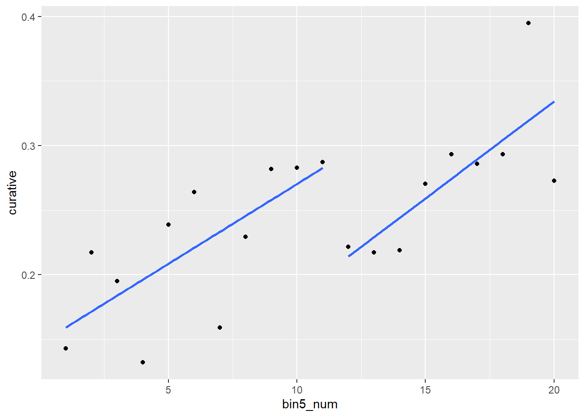
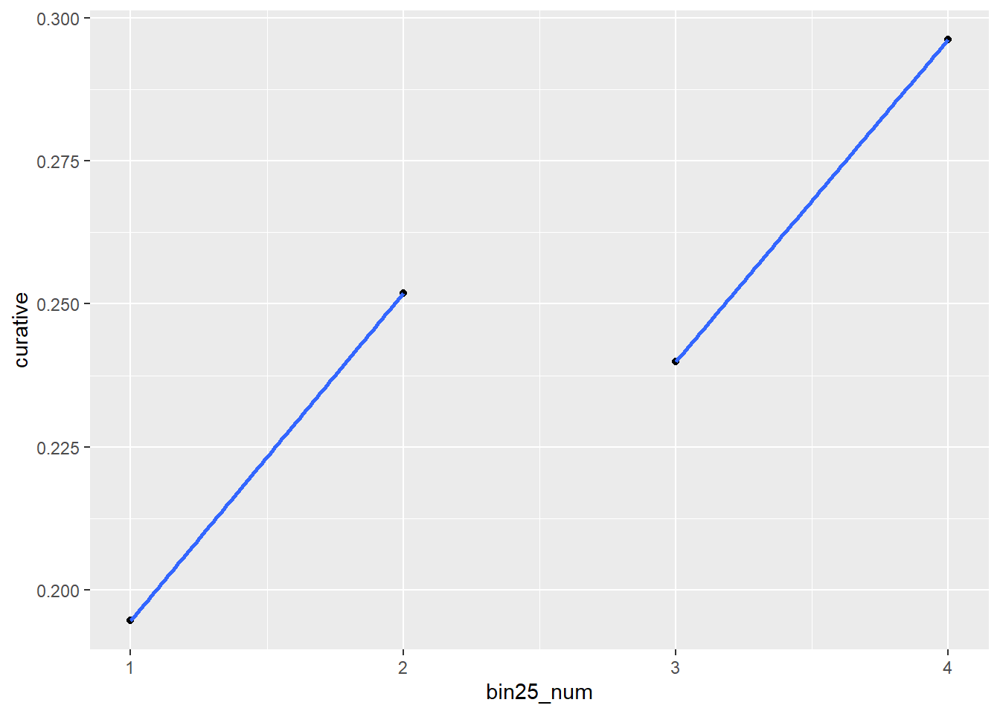
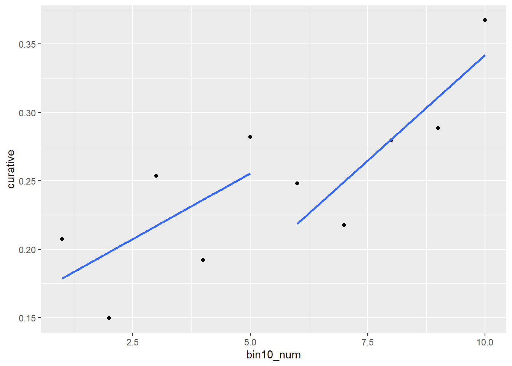
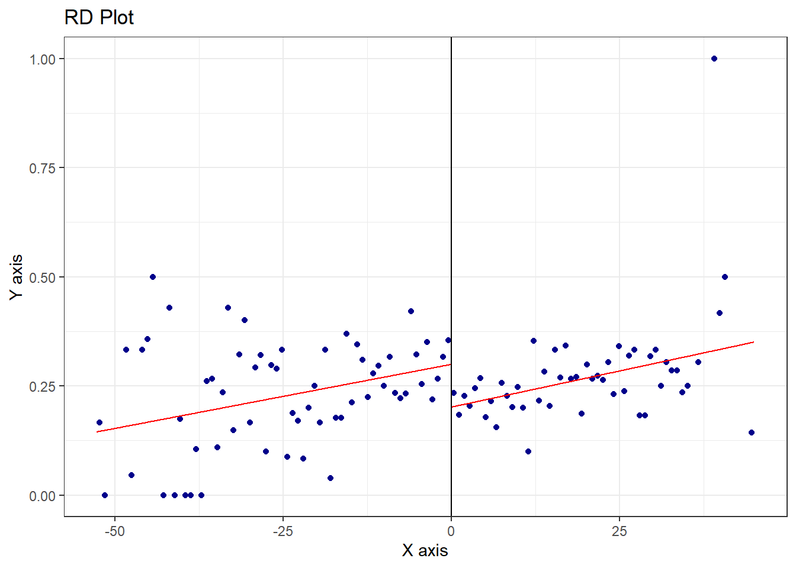
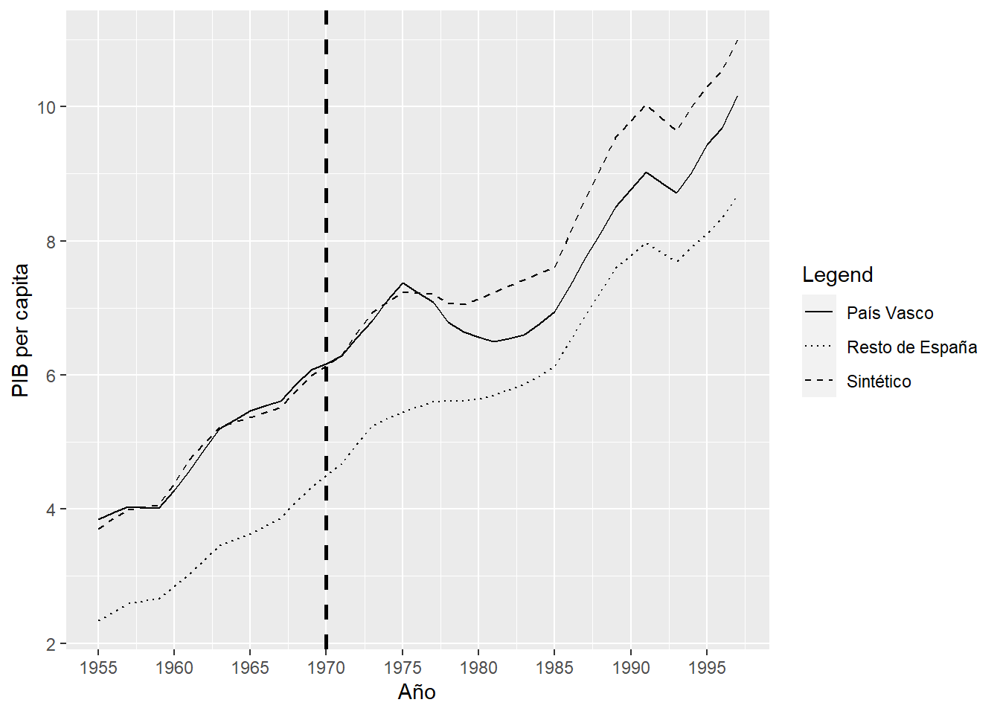
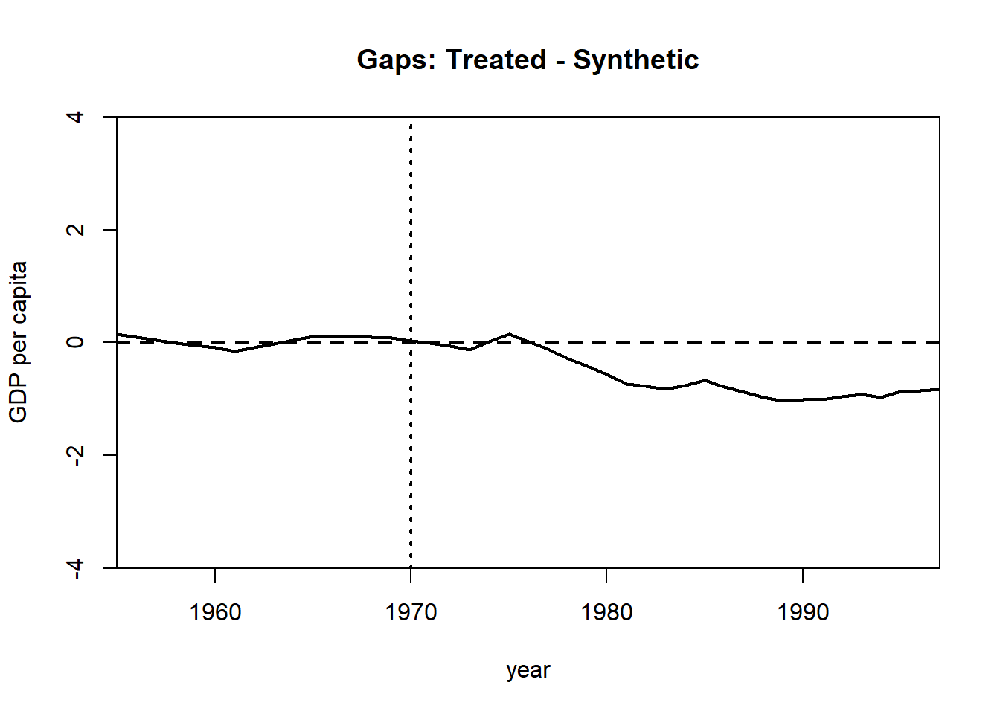
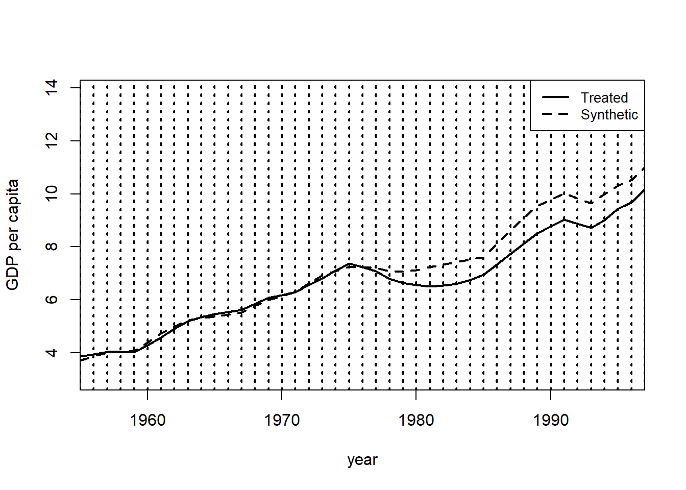
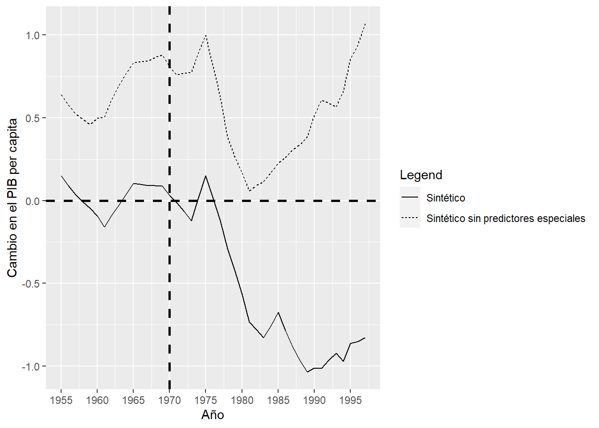
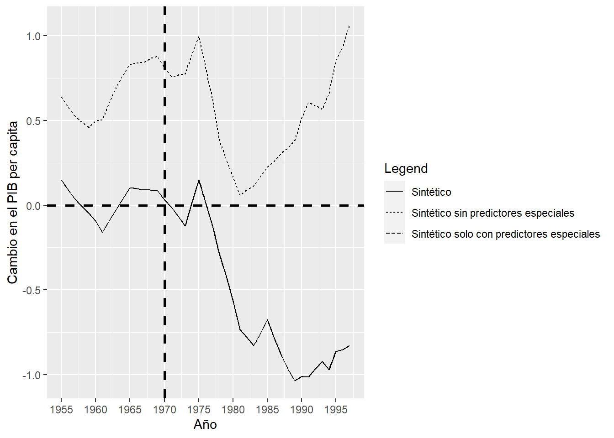
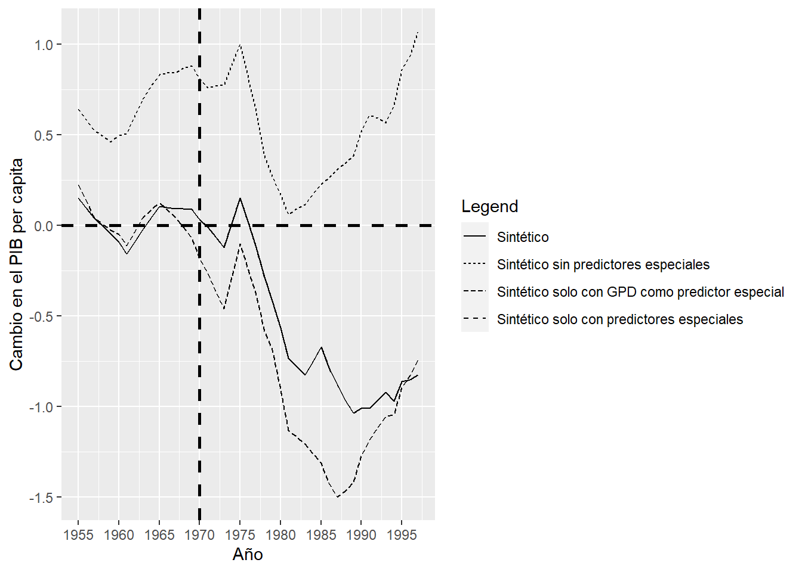

::: {.cell}

:::


## Pregunta 1

Los datos del archivo *salud_peru.csv* contienen información de una encuesta en hogares realizada en Perú. Un programa del gobierno otorgó un seguro de salud para cubrir a hogares de trabajadores informales y pobres, típicamente excluidos de los servicios de salud. Para ello, se uso un índice de ingreso (IFH), expresado en soles, para determinar la elegibilidad. Aquellos hogares con un IFH menor o igual a 55 soles son considerados pobres. Se desea estimar el efecto del programa en la probabilidad de recibir algún tipo de anteción médica, **curative**, y sobre la probabilidad de recibir algún tipo de asistencia médica en un hospital o con un doctor, **hospinter**. La columna **ifh** contiene el indicador del ingreso.

a. [10 puntos] Genere una gráfica donde muestre evidencia de una discontinuidad en la variable **curative** para aquellos hogares que recibieron los beneficios del programa. Debe usar solo a los trabajadores informales, *formal==0*. Primero, realice la gráfica con una ventana de 100 soles a la izquierda y 100 soles a la derecha del corte de elegibilidad y en la que cada punto represente la media de la variable **curative** en *bins* de 5 soles. Agregue una línea de regresión lineal para cada lado del corte de elegibilidad.

   **Nota: Esta pregunta estuvo basada en el estudiod de Bernal, Carpio & Klein (2017).[^1]**
   
   [^1]: Bernal, N., Carpio, M. A., & Klein, T. J. (2017). The effects of access to health insurance: evidence from a regression discontinuity design in Peru. Journal of Public Economics, 154, 122-136.

   *Construimos un indicador de elegibilidad:*


   ::: {.cell}
   
   ```{.r .cell-code}
   salud <- read_csv("../files/salud_peru.csv") %>% 
     filter(formal==0) %>% 
     mutate(ifh_norm=ifh-corte,
            abajo_corte=ifelse(ifh<=corte, 1, 0))
   ```
   :::


   *Partimos la muestra en grupos de cinco soles:*
   

   ::: {.cell}
   
   ```{.r .cell-code}
   salud <- salud %>% 
     mutate(bin5=cut(ifh, breaks = c(seq(from=0, to=100, by=5))))
   ```
   :::


   *Construimos la proporción con curative==1 en cada grupo*:
   

   ::: {.cell}
   
   ```{.r .cell-code}
   salud5 <- salud %>% 
     group_by(bin5) %>% 
     summarise(curative=mean(curative, na.rm=T)) %>% 
     ungroup()
   
   salud5 <- salud5 %>% 
     mutate(bin5_num = seq(1:nrow(salud5)))
   ```
   :::


   *Y hacemos el gráfico:*
   

   ::: {.cell}
   
   ```{.r .cell-code}
   salud5 %>% 
     ggplot(aes(x = bin5_num,
                y = curative)) +
     geom_point() +
     geom_smooth(method = lm,
                 se = F,
                 data = filter(salud5, bin5_num<=11)) +
     geom_smooth(method = lm,
                 se = F,
                 data = filter(salud5, bin5_num>11))
   ```
   
   ::: {.cell-output-display}
   {width=672}
   :::
   :::


a. [5 puntos] Genere el mismo gráfico que en la parte a., pero ahora con una ventana de 25 soles a cada lado de la discontinuidad.

   *Siguiendo el mismo procedimiento:*


   ::: {.cell}
   
   ```{.r .cell-code}
   salud <- salud %>% 
     mutate(bin25=cut(ifh, breaks = c(seq(from=0, to=100, by=25))))
   
   salud25  <- salud %>% 
     group_by(bin25) %>% 
     summarise(curative=mean(curative, na.rm=T)) %>% 
     ungroup()
   
   salud25 <- salud25 %>% 
     mutate(bin25_num = seq(1:nrow(salud25)))
   
   salud25 %>% 
     ggplot(aes(x = bin25_num,
                y = curative)) +
     geom_point() +
     geom_smooth(method = lm,
                 se = F,
                 data = filter(salud25, bin25_num<=2)) +
     geom_smooth(method = lm,
                 se = F,
                 data = filter(salud25, bin25_num>2))
   ```
   
   ::: {.cell-output-display}
   {width=672}
   :::
   :::


a. [5 puntos] Genere el mismo gráfico que en la parte a., pero calcule la media de la variable **curative** en *bins* de 10 soles.

   *Siguiendo el mismo procedimiento:*


   ::: {.cell}
   
   ```{.r .cell-code}
   salud <- salud %>% 
     mutate(bin10=cut(ifh, breaks = c(seq(from=0, to=100, by=10))))
   
   salud10 <- salud %>% 
     group_by(bin10) %>% 
     summarise(curative=mean(curative, na.rm=T)) %>% 
     ungroup()
   
   salud10 <- salud10 %>% 
     mutate(bin10_num = seq(1:nrow(salud10)))
   
   salud10 %>% 
     ggplot(aes(x = bin10_num,
                y = curative)) +
     geom_point() +
     geom_smooth(method = lm,
                 se = F,
                 data = filter(salud10, bin10_num<=5)) +
     geom_smooth(method = lm,
                 se = F,
                 data = filter(salud10, bin10_num>5))
   ```
   
   ::: {.cell-output-display}
   {width=672}
   :::
   :::


a. [5 puntos] Ahora use *rdplot* del paquete *rdrobust* para construir el mismo gráfico.

   *Podemos usar rdplot para construir el gráfico, lo que nos permite seleccionar de manera óptima el número de ventanas en las que se construirá la proporción de personas que recibieron atención médica.*
    

   ::: {.cell}
   
   ```{.r .cell-code}
   (rdplot(y = salud$curative,
       x = salud$ifh_norm,
       c=0,
       p=1))
   ```
   
   ::: {.cell-output .cell-output-stdout}
   ```
   [1] "Mass points detected in the running variable."
   ```
   :::
   
   ::: {.cell-output-display}
   {width=672}
   :::
   
   ::: {.cell-output .cell-output-stdout}
   ```
   Call: rdplot
   
   Number of Obs.                 4161
   Kernel                      Uniform
   
   Number of Obs.                 1786            2375
   Eff. Number of Obs.            1786            2375
   Order poly. fit (p)               1               1
   BW poly. fit (h)             52.680          45.000
   Number of bins scale          1.000           1.000
   ```
   :::
   :::


a. [10 puntos] Estime la versión más básica de un modelo de regresión discontinua para el efecto del programa sobre **hospinter**. Reporte el coeficiente estimado del efecto del tratamiento y su significancia estadística. Use una ventana de 20 soles en el IFH antes y después del corte de elegibilidad. Interprete sus resultados.


   ::: {.cell}
   
   ```{.r .cell-code}
   r1 <- lm(hospinter ~ ifh_norm + abajo_corte,
          data=filter(salud, ifh_norm>=-20 & ifh_norm <=20))
   
   stargazer(r1,
             type = 'text',
             keep = 'abajo_corte',
             se = list(sqrt(diag(vcovHC(r1, type='HC1')))),
             column.labels = '20 soles')
   ```
   
   ::: {.cell-output .cell-output-stdout}
   ```
   
   ===============================================
                           Dependent variable:    
                       ---------------------------
                                hospinter         
                                20 soles          
   -----------------------------------------------
   abajo_corte                   0.047**          
                                 (0.019)          
                                                  
   -----------------------------------------------
   Observations                   2,799           
   R2                             0.002           
   Adjusted R2                    0.001           
   Residual Std. Error      0.263 (df = 2796)     
   F Statistic           3.043** (df = 2; 2796)   
   ===============================================
   Note:               *p<0.1; **p<0.05; ***p<0.01
   ```
   :::
   :::

    
   *Con un modelo lineal y una dummy de elegibilidad, estimamos un efecto de 4.7 puntos porcentuales en la probabilidad de recibir algún tipo de asistencia médica.*
    
a. [5 puntos] Estime la misma especificación que en la parte d., pero ahora con una ventana de 10 soles en el IFH. Interprete sus resultados.

   *Al restringir la ventana de análisis obtenemos un efecto estimado de 6.6 puntos porcentuales:*


   ::: {.cell}
   
   ```{.r .cell-code}
   r2 <- lm(hospinter ~ ifh_norm + abajo_corte,
          data=filter(salud, ifh_norm>=-10 & ifh_norm <=10))
   
   
   stargazer(r1, r2,
             type = 'text',
             keep = 'abajo_corte',
             se = list(sqrt(diag(vcovHC(r1, type='HC1'))),
                       sqrt(diag(vcovHC(r2, type='HC1')))),
             column.labels = c('20 soles', '10 soles'))
   ```
   
   ::: {.cell-output .cell-output-stdout}
   ```
   
   =================================================================
                                    Dependent variable:             
                       ---------------------------------------------
                                         hospinter                  
                              20 soles               10 soles       
                                (1)                    (2)          
   -----------------------------------------------------------------
   abajo_corte                0.047**                0.066**        
                              (0.019)                (0.026)        
                                                                    
   -----------------------------------------------------------------
   Observations                2,799                  1,654         
   R2                          0.002                  0.004         
   Adjusted R2                 0.001                  0.003         
   Residual Std. Error   0.263 (df = 2796)      0.264 (df = 1651)   
   F Statistic         3.043** (df = 2; 2796) 3.399** (df = 2; 1651)
   =================================================================
   Note:                                 *p<0.1; **p<0.05; ***p<0.01
   ```
   :::
   :::


a. [5 puntos] Regrese a una ventana de 20 soles como en la parte d., pero ahora permita un coeficiente distinto para el IFH antes y después del corte, y un polinomio de orden 2 para la variable de asignación. Interprete sus resultados.

   *Permitiendo pendientes distintas y con un polinomio cuadrático de la variable de asignación obtenemos un efecto estimado de 6.8 puntos porcentuales:*
    

   ::: {.cell}
   
   ```{.r .cell-code}
   r3 <- lm(hospinter ~ ifh_norm*abajo_corte + I(ifh_norm^2)*abajo_corte,
          data=filter(salud, ifh_norm>=-20 & ifh_norm <=20))
   
   
   stargazer(r1, r2, r3,
             type = 'text',
             keep = 'abajo_corte',
             se = list(sqrt(diag(vcovHC(r1, type='HC1'))),
                       sqrt(diag(vcovHC(r2, type='HC1'))),
                       sqrt(diag(vcovHC(r3, type='HC1')))),
             column.labels = c('20 soles', '10 soles', '20 soles diferentes pendientes'))
   ```
   
   ::: {.cell-output .cell-output-stdout}
   ```
   
   =====================================================================================================
                                                        Dependent variable:                             
                            ----------------------------------------------------------------------------
                                                             hospinter                                  
                                   20 soles               10 soles        20 soles diferentes pendientes
                                     (1)                    (2)                        (3)              
   -----------------------------------------------------------------------------------------------------
   abajo_corte                     0.047**                0.066**                    0.068**            
                                   (0.019)                (0.026)                    (0.030)            
                                                                                                        
   ifh_norm:abajo_corte                                                               -0.003            
                                                                                     (0.007)            
                                                                                                        
   abajo_corte:I(ifh_norm2)                                                           0.0003            
                                                                                     (0.0004)           
                                                                                                        
   -----------------------------------------------------------------------------------------------------
   Observations                     2,799                  1,654                      2,799             
   R2                               0.002                  0.004                      0.003             
   Adjusted R2                      0.001                  0.003                      0.001             
   Residual Std. Error        0.263 (df = 2796)      0.264 (df = 1651)          0.263 (df = 2793)       
   F Statistic              3.043** (df = 2; 2796) 3.399** (df = 2; 1651)      1.505 (df = 5; 2793)     
   =====================================================================================================
   Note:                                                                     *p<0.1; **p<0.05; ***p<0.01
   ```
   :::
   :::

    
   *Como nota, los autores estiman el siguiente modelo para obtener los resultados reportados en la tabla 1 del artículo de 7.8 puntos porcentuales. Ellos introducen una serie de controles, lo cual no es raro en los análisis de diseños con discontinuidades:*
    

   ::: {.cell}
   
   ```{.r .cell-code}
   r4 <- lm(hospinter ~ ifh_norm + abajo_corte + ifh_norm*abajo_corte + mujer + edad + educ + mieperho + hhmujer + high*ifh_norm + high*abajo_corte ,
          data=filter(salud, ifh_norm>=-20 & ifh_norm <=20))
   
   
   
   stargazer(r1, r2, r3, r4,
             type = 'text',
             keep = 'abajo_corte',
             se = list(sqrt(diag(vcovHC(r1, type='HC1'))),
                       sqrt(diag(vcovHC(r2, type='HC1'))),
                       sqrt(diag(vcovHC(r3, type='HC1'))),
                       sqrt(diag(vcovHC(r4, type='HC1')))),
             column.labels = c('20 soles', '10 soles', '20 soles diferentes pendientes', 'publicado'))
   ```
   
   ::: {.cell-output .cell-output-stdout}
   ```
   
   ==============================================================================================================================
                                                                     Dependent variable:                                         
                            -----------------------------------------------------------------------------------------------------
                                                                          hospinter                                              
                                   20 soles               10 soles        20 soles diferentes pendientes        publicado        
                                     (1)                    (2)                        (3)                         (4)           
   ------------------------------------------------------------------------------------------------------------------------------
   abajo_corte                     0.047**                0.066**                    0.068**                     0.078***        
                                   (0.019)                (0.026)                    (0.030)                     (0.028)         
                                                                                                                                 
   ifh_norm:abajo_corte                                                               -0.003                     -0.0003         
                                                                                     (0.007)                     (0.002)         
                                                                                                                                 
   abajo_corte:I(ifh_norm2)                                                           0.0003                                     
                                                                                     (0.0004)                                    
                                                                                                                                 
   abajo_corte:high                                                                                               -0.056         
                                                                                                                 (0.038)         
                                                                                                                                 
   ------------------------------------------------------------------------------------------------------------------------------
   Observations                     2,799                  1,654                      2,799                       2,799          
   R2                               0.002                  0.004                      0.003                       0.024          
   Adjusted R2                      0.001                  0.003                      0.001                       0.020          
   Residual Std. Error        0.263 (df = 2796)      0.264 (df = 1651)          0.263 (df = 2793)           0.260 (df = 2787)    
   F Statistic              3.043** (df = 2; 2796) 3.399** (df = 2; 1651)      1.505 (df = 5; 2793)      6.131*** (df = 11; 2787)
   ==============================================================================================================================
   Note:                                                                                              *p<0.1; **p<0.05; ***p<0.01
   ```
   :::
   :::


a. [5 puntos] Use *rdrobust* para estimar el efecto usando un polinomio de orden 2 y una regresión local no paramétrica. Use algún selector de ancho de banda óptimo.

   *Podemos usar rdrobust para estimar el efecto con la selección óptima del ancho de ventana:*
    

   ::: {.cell}
   
   ```{.r .cell-code}
   summary(rdrobust(y=salud$hospinter,
                    x=salud$ifh,
                    c=55,
                    p=2,
                    bwselect='mserd',
                    vce = 'hc3'))
   ```
   
   ::: {.cell-output .cell-output-stdout}
   ```
   Sharp RD estimates using local polynomial regression.
   
   Number of Obs.                 4161
   BW type                       mserd
   Kernel                   Triangular
   VCE method                      HC3
   
   Number of Obs.                 1786         2375
   Eff. Number of Obs.             980         1528
   Order est. (p)                    2            2
   Order bias  (q)                   3            3
   BW est. (h)                  16.585       16.585
   BW bias (b)                  24.402       24.402
   rho (h/b)                     0.680        0.680
   Unique Obs.                     252          246
   
   =============================================================================
           Method     Coef. Std. Err.         z     P>|z|      [ 95% C.I. ]       
   =============================================================================
     Conventional    -0.082     0.035    -2.313     0.021    [-0.151 , -0.012]    
           Robust         -         -    -2.229     0.026    [-0.168 , -0.011]    
   =============================================================================
   ```
   :::
   :::


   *El efecto estimado es de 8.2 puntos porcentuales. La venta seleccionada de manera óptima es de 16.56 soles usando el criterio del error cuadrático medio.*
   

## Pregunta 2

El archivo *basque.csv* contiene los datos empleados por Abadie y Gardeazabal (2003) para estimar el efecto del terrorismo en el PIB per cápita (**gdpcap**) en el País Vasco usando el método de control sintético. Los autores consideran como periodo pre intervención a 1955 - 1969.

a. [10 puntos] Estime el control sintético del PIB per cápita del País Vasco usando como *grupo donador* al resto de las regiones de España. Esto es, encuentre la matriz $W$ que otorga pesos a las distintas regiones usando una serie de predictores observables. Para este propósito, use como predictores el promedio de las siguientes variables para el periodo 1964-1969:

    - La inversión como porcentaje del PIB, **invest**
    - El porcentaje de la población analfabeta, **school.illit**
    - El porcentaje de la población con educación primaria, **school.prim**
    -	El porcentaje de la población con educación media, **school.med**
    -	El porcentaje de la población con educación superior, **school.high**
    -	El porcentaje de la población con educación más que superior, **school.post.high**
    
     Además, use como *predictores especiales* los siguientes valores:

    -	El promedio del PIB per capita, **gdpcap**, de 1960 a 1969
    -	La densidad de población, **popdens**, de 1969
    -	El promedio de la participación de la agricultura, **sec.agriculture**, de 1961 a 1969
    -	El promedio de la participación de la energía, **sec.energy**, de 1961 a 1969
    - El promedio de la participación de la industria, **sec.industry**, de 1961 a 1969
    -	El promedio de la participación de la construcción, **sec.construction**, de 1961 a 1969
    -	El promedio de la participación de los servicios, **sec.services.venta**, de 1961 a 1969
    -	El promedio de la participación de los servicios no comerciables, **sec.services.nonventa**, de 1961 a 1969

    Note que el País Vasco está identificado con el número 17 de la variable **regionno**. Realice el procedimiento de optimización para minimizar las discrepancias entre la unidad tratada y su sintético usando el periodo 1960-1969.

    ¿Qué regiones y con qué pesos contribuyen a construir el País Vasco sintético?

    
    
   *Implementamos el método de control sintético:*


   

   ::: {.cell}
   
   ```{.r .cell-code}
   data_vasco <- data.frame(read_csv("basque.csv"))
   
   dataprep.out <- dataprep(foo = data_vasco,
                     predictors = c("invest", "school.illit", "school.prim", "school.med", "school.high", "school.post.high"),
                     predictors.op = c("mean"),
                     dependent = c("gdpcap"),
                     unit.variable = c("regionno"),
                     time.variable = c("year"),
                     special.predictors = list(
                       list("gdpcap", 1960:1969,c("mean")),
                       list("sec.agriculture", 1961:1969,c("mean")),
                       list("sec.energy", 1961:1969,c("mean")),
                       list("sec.industry", 1961:1969,c("mean")),
                       list("sec.construction", 1961:1969,c("mean")),
                       list("sec.services.venta", 1961:1969,c("mean")),
                       list("sec.services.nonventa", 1961:1969,c("mean")),
                       list("popdens", 1969,c("mean"))),
                     treatment.identifier = 17,
                     controls.identifier = c(2:16,18),
                     time.predictors.prior = c(1964:1969),
                     time.optimize.ssr = c(1960:1969),
                     unit.names.variable = c("regionname"),
                     time.plot = c(1955:1997))
   ```
   :::

   ::: {.cell}
   
   ```{.r .cell-code}
   synth.out <- synth(data.prep.obj = dataprep.out)
   ```
   
   ::: {.cell-output .cell-output-stdout}
   ```
   
   X1, X0, Z1, Z0 all come directly from dataprep object.
   
   
   **************** 
    searching for synthetic control unit  
    
   
   **************** 
   **************** 
   **************** 
   
   MSPE (LOSS V): 0.008864572 
   
   solution.v:
    0.0006492116 0.01764209 0.002961697 2.81393e-05 0.00463772 0.0006428704 0.005494548 0.1765645 0.001377245 0.1788794 0.03953784 0.001454675 0.1204615 0.4496685 
   
   solution.w:
    8.6e-09 1.74e-08 2.52e-08 2.07e-08 1.51e-08 2.043e-07 1.34e-08 2.44e-08 0.8508151 7.95e-08 8.3e-09 2.5e-08 0.1491843 1.99e-08 3.74e-08 5.73e-08 
   ```
   :::
   
   ```{.r .cell-code}
   synth.tables <- synth.tab(dataprep.res = dataprep.out,
                             synth.res = synth.out)
   ```
   :::

 
   *Recuperamos los pesos:*


   ::: {.cell}
   
   ```{.r .cell-code}
   print(synth.tables)
   ```
   
   ::: {.cell-output .cell-output-stdout}
   ```
   $tab.pred
                                            Treated Synthetic Sample Mean
   invest                                    24.647    21.583      21.424
   school.illit                              39.888   256.337     170.786
   school.prim                             1031.742  2730.105    1127.186
   school.med                                90.359   223.340      76.260
   school.high                               25.728    63.437      24.235
   school.post.high                          13.480    36.153      13.478
   special.gdpcap.1960.1969                   5.285     5.271       3.581
   special.sec.agriculture.1961.1969          6.844     6.179      21.353
   special.sec.energy.1961.1969               4.106     2.760       5.310
   special.sec.industry.1961.1969            45.082    37.636      22.425
   special.sec.construction.1961.1969         6.150     6.952       7.276
   special.sec.services.venta.1961.1969      33.754    41.104      36.528
   special.sec.services.nonventa.1961.1969    4.072     5.371       7.111
   special.popdens.1969                     246.890   196.283      99.414
   
   $tab.v
                                           v.weights
   invest                                  0.001    
   school.illit                            0.018    
   school.prim                             0.003    
   school.med                              0        
   school.high                             0.005    
   school.post.high                        0.001    
   special.gdpcap.1960.1969                0.005    
   special.sec.agriculture.1961.1969       0.177    
   special.sec.energy.1961.1969            0.001    
   special.sec.industry.1961.1969          0.179    
   special.sec.construction.1961.1969      0.04     
   special.sec.services.venta.1961.1969    0.001    
   special.sec.services.nonventa.1961.1969 0.12     
   special.popdens.1969                    0.45     
   
   $tab.w
      w.weights                   unit.names unit.numbers
   2      0.000                    Andalucia            2
   3      0.000                       Aragon            3
   4      0.000       Principado De Asturias            4
   5      0.000             Baleares (Islas)            5
   6      0.000                     Canarias            6
   7      0.000                    Cantabria            7
   8      0.000              Castilla Y Leon            8
   9      0.000           Castilla-La Mancha            9
   10     0.851                     Cataluna           10
   11     0.000         Comunidad Valenciana           11
   12     0.000                  Extremadura           12
   13     0.000                      Galicia           13
   14     0.149        Madrid (Comunidad De)           14
   15     0.000           Murcia (Region de)           15
   16     0.000 Navarra (Comunidad Foral De)           16
   18     0.000                   Rioja (La)           18
   
   $tab.loss
           Loss W      Loss V
   [1,] 0.3479783 0.008864572
   ```
   :::
   :::


   *El País Vasco sintético se obtiene como una combinación de Cataluña y Madrid, con unos pesos de 0.851 y 0.149, respectivamente.*

a. [5 puntos] Obtenga un gráfico en donde represente las series de tiempo del PIB per cápita del País Vasco que efectivamente se realizó, la de su correspondiente control sintético y la del promedio simple del resto de las regiones españolas.

   *Recuperamos las series originales y sintética del País Vasco:*


   ::: {.cell}
   
   ```{.r .cell-code}
   Ys <- dataprep.out$Y0plot %*% synth.out$solution.w
                   
   Y1 <- dataprep.out$Y1plot
   ```
   :::

    
   *Por otro lado, podemos calcular el promedio sobre todas las regiones de la matriz $Y0plot$:*
    


   ::: {.cell}
   
   ```{.r .cell-code}
   Y0media <- matrix(rowMeans(dataprep.out$Y0plot))
   ```
   :::


   *Y ponemos todo en un data frame para graficarlo fácilmente:*
    


   ::: {.cell}
   
   ```{.r .cell-code}
   data.plot <- as.data.frame(cbind(Y1,Ys, Y0media))
   
   colnames(data.plot) <- c("Y1","Ys","Y0media")
   data.plot <- data.plot %>% 
   mutate(year=seq(from=1955, to=1997))
   
   #Gráfico de series
   data.plot %>% 
   ggplot(aes(x=year))+
   geom_line(aes(y=Y1, linetype = "País Vasco")) +
   geom_line(aes(y=Ys, linetype = "Sintético"))+
   geom_line(aes(y=Y0media, linetype = "Resto de España"))+
   geom_vline(xintercept=1970, color = "black", size=1, linetype="dashed")+
   scale_x_continuous(breaks=seq(1955, 1997, 5))+
   labs(x = "Año",
       y = "PIB per capita",
       linetype = "Legend") +
   scale_linetype_manual(values = c("País Vasco"="solid", "Sintético"="dashed", "Resto de España"="dotted"))
   ```
   
   ::: {.cell-output-display}
   {width=672}
   :::
   :::


   *El País Vasco era más rico que el promedio del resto de las regiones españolas. Durante el periodo post al inicio de la actividad terrorista, el resto de España siguió creciendo, pero el País Vasco se acercó hacia abajo.*

a. [5 puntos] Genere una gráfica de brecha que muestre el efecto del terrorismo sobre el PIB per cápita. La brecha es la diferencia entre la serie de tiempo realizada y su contraparte sintética.

   *El gráfico de brechas se obtiene fácilmente con las funciones de Synth:*


   ::: {.cell}
   
   ```{.r .cell-code}
   gaps.plot(synth.res = synth.out,
         dataprep.res = dataprep.out,
         tr.intake = 1970,
         Ylab = c("GDP per capita"),
         Xlab = c("year"), 
         Ylim = c(-4,4))
   ```
   
   ::: {.cell-output-display}
   {width=672}
   :::
   :::

    
   *El gráfico de las trayectorias es:*


   ::: {.cell}
   
   ```{.r .cell-code}
   path.plot(synth.res = synth.out,
         dataprep.res = dataprep.out,
         tr.intake = 1955:1997,
         Ylab = c("GDP per capita"),
         Xlab = c("year"))
   ```
   
   ::: {.cell-output-display}
   {width=672}
   :::
   :::

    

a. [10 puntos] Ahora verificará la robustez de los resultados de este trabajo a la elección de los predictores que entran en las matrices $X_1$ y $X_0$ estudiadas en clase. Primero, obtenga de nuevo el control sintético, esta vez eliminando *todos* los predictores especiales. Construya la correspondiente gráfica de brecha y sobrepóngala con la gráfica de brecha que se obtiene con la especificación de la parte a.


   ::: {.cell}
   
   ```{.r .cell-code}
   dataprep.out.2 <- dataprep(foo = data_vasco,
                     predictors = c("invest", "school.illit", "school.prim", "school.med", "school.high", "school.post.high"),
                     predictors.op = c("mean"),
                     dependent = c("gdpcap"),
                     unit.variable = c("regionno"),
                     time.variable = c("year"),
                     treatment.identifier = 17,
                     controls.identifier = c(2:16,18),
                     time.predictors.prior = c(1964:1969),
                     time.optimize.ssr = c(1960:1969),
                     unit.names.variable = c("regionname"),
                     time.plot = c(1955:1997))
   
   synth.out.2 <- synth(data.prep.obj = dataprep.out.2)
   ```
   
   ::: {.cell-output .cell-output-stdout}
   ```
   
   X1, X0, Z1, Z0 all come directly from dataprep object.
   
   
   **************** 
    searching for synthetic control unit  
    
   
   **************** 
   **************** 
   **************** 
   
   MSPE (LOSS V): 0.557369 
   
   solution.v:
    0.158524 0.649228 8.0163e-06 0.0009854878 0.1912543 2.531e-07 
   
   solution.w:
    2.0448e-06 4.16351e-05 5.8443e-06 3.27897e-05 9.0538e-06 0.6474261 4.81822e-05 1.12328e-05 7.805e-07 5.2039e-06 1.42574e-05 9.5262e-06 0.3220171 2.41067e-05 0.02728823 0.003063902 
   ```
   :::
   
   ```{.r .cell-code}
   Ys.2 <- dataprep.out.2$Y0plot %*% synth.out.2$solution.w
   ```
   :::

   *Obtenemos la brecha usando la especificación original de la parte a. y la nueva de la parte d.:*


   ::: {.cell}
   
   ```{.r .cell-code}
   data.plot <- cbind(data.plot, Ys.2) %>% 
     rename(Ys.2 = w.weight) %>% 
     mutate(gap = Y1-Ys,
            gap.2 = Y1-Ys.2)
   ```
   :::


   *Graficamos las dos brechas:*
   

   ::: {.cell}
   
   ```{.r .cell-code}
   data.plot %>% 
     ggplot(aes(x=year))+
     geom_line(aes(y=gap, linetype = "Sintético"))+
     geom_line(aes(y=gap.2, linetype = "Sintético sin predictores especiales")) +
     geom_vline(xintercept=1970, color = "black", size=1, linetype="dashed")+
     geom_hline(yintercept=0, color = "black", size=1, linetype="dashed")+
     scale_x_continuous(breaks=seq(1955, 1997, 5))+
     labs(x = "Año",
          y = "Cambio en el PIB per capita",
          linetype = "Legend")
   ```
   
   ::: {.cell-output-display}
   {width=672}
   :::
   :::


a. [10 puntos] Regrese a la especificación original de la parte a. y ahora estime el control sintético empleando *solamente* predictores especiales. Construya la correspondiente gráfica de brecha y sobrepóngala con las gráficas de brechas que se obtiene con la especificación de la parte a. y de la parte d.


   

   ::: {.cell}
   
   ```{.r .cell-code}
   dataprep.out.3 <- dataprep(foo = data_vasco,
                     dependent = c("gdpcap"),
                     unit.variable = c("regionno"),
                     time.variable = c("year"),
                     special.predictors = list(
                       list("gdpcap", 1960:1969,c("mean")),
                       list("sec.agriculture", 1961:1969,c("mean")),
                       list("sec.energy", 1961:1969,c("mean")),
                       list("sec.industry", 1961:1969,c("mean")),
                       list("sec.construction", 1961:1969,c("mean")),
                       list("sec.services.venta", 1961:1969,c("mean")),
                       list("sec.services.nonventa", 1961:1969,c("mean")),
                       list("popdens", 1969,c("mean"))),
                     treatment.identifier = 17,
                     controls.identifier = c(2:16,18),
                     time.predictors.prior = c(1964:1969),
                     time.optimize.ssr = c(1960:1969),
                     unit.names.variable = c("regionname"),
                     time.plot = c(1955:1997))
   ```
   :::

   ::: {.cell}
   
   ```{.r .cell-code}
   synth.out.3 <- synth(data.prep.obj = dataprep.out.3)
   ```
   
   ::: {.cell-output .cell-output-stdout}
   ```
   
   X1, X0, Z1, Z0 all come directly from dataprep object.
   
   
   **************** 
    searching for synthetic control unit  
    
   
   **************** 
   **************** 
   **************** 
   
   MSPE (LOSS V): 0.008864554 
   
   solution.v:
    0.07746593 0.02894192 0.01187302 0.03894489 0.05917415 0.0437988 0.1911735 0.5486278 
   
   solution.w:
    2.4e-09 3.2e-09 1.39e-08 2e-09 3.7e-09 4.53e-08 3.3e-09 1.09e-08 0.8508135 4.94e-08 1.4e-09 1.09e-08 0.1491863 5.5e-09 7.2e-09 1.56e-08 
   ```
   :::
   
   ```{.r .cell-code}
   Ys.3 <- dataprep.out.3$Y0plot %*% synth.out.3$solution.w
   ```
   :::

   ::: {.cell}
   
   ```{.r .cell-code}
   data.plot <- cbind(data.plot, Ys.3) %>% 
     rename(Ys.3 = w.weight) %>% 
     mutate(gap.3 = Y1-Ys.3)
   ```
   :::

   ::: {.cell}
   
   ```{.r .cell-code}
   synth.tables.3 <- synth.tab(dataprep.res = dataprep.out.3,
                               synth.res = synth.out.3)
   ```
   :::

   ::: {.cell}
   
   ```{.r .cell-code}
   print(synth.tables.3)
   ```
   
   ::: {.cell-output .cell-output-stdout}
   ```
   $tab.pred
                                           Treated Synthetic Sample Mean
   special.gdpcap.1960.1969                  5.285     5.271       3.581
   special.sec.agriculture.1961.1969         6.844     6.179      21.353
   special.sec.energy.1961.1969              4.106     2.760       5.310
   special.sec.industry.1961.1969           45.082    37.636      22.425
   special.sec.construction.1961.1969        6.150     6.952       7.276
   special.sec.services.venta.1961.1969     33.754    41.104      36.528
   special.sec.services.nonventa.1961.1969   4.072     5.371       7.111
   special.popdens.1969                    246.890   196.284      99.414
   
   $tab.v
                                           v.weights
   special.gdpcap.1960.1969                0.077    
   special.sec.agriculture.1961.1969       0.029    
   special.sec.energy.1961.1969            0.012    
   special.sec.industry.1961.1969          0.039    
   special.sec.construction.1961.1969      0.059    
   special.sec.services.venta.1961.1969    0.044    
   special.sec.services.nonventa.1961.1969 0.191    
   special.popdens.1969                    0.549    
   
   $tab.w
      w.weights                   unit.names unit.numbers
   2      0.000                    Andalucia            2
   3      0.000                       Aragon            3
   4      0.000       Principado De Asturias            4
   5      0.000             Baleares (Islas)            5
   6      0.000                     Canarias            6
   7      0.000                    Cantabria            7
   8      0.000              Castilla Y Leon            8
   9      0.000           Castilla-La Mancha            9
   10     0.851                     Cataluna           10
   11     0.000         Comunidad Valenciana           11
   12     0.000                  Extremadura           12
   13     0.000                      Galicia           13
   14     0.149        Madrid (Comunidad De)           14
   15     0.000           Murcia (Region de)           15
   16     0.000 Navarra (Comunidad Foral De)           16
   18     0.000                   Rioja (La)           18
   
   $tab.loss
           Loss W      Loss V
   [1,] 0.3302474 0.008864554
   ```
   :::
   :::


   *Graficamos las dos brechas:*
   

   ::: {.cell}
   
   ```{.r .cell-code}
   data.plot %>% 
     ggplot(aes(x=year))+
     geom_line(aes(y=gap, linetype = "Sintético"))+
     geom_line(aes(y=gap.2, linetype = "Sintético sin predictores especiales")) +
     geom_line(aes(y=gap.3, linetype = "Sintético solo con predictores especiales")) +
     geom_vline(xintercept=1970, color = "black", size=1, linetype="dashed")+
     geom_hline(yintercept=0, color = "black", size=1, linetype="dashed")+
     scale_x_continuous(breaks=seq(1955, 1997, 5))+
     labs(x = "Año",
          y = "Cambio en el PIB per capita",
          linetype = "Legend")
   ```
   
   ::: {.cell-output-display}
   {width=672}
   :::
   :::


a. [10 puntos] Finalmente, regrese a la especificación original de la parte a., pero ahora conserve en los predictores especiales solo al PIB per cápita (**gdpcap**), además de la lista de predictores convencionales usadas en la especificación original. Construya la correspondiente gráfica de brecha y sobrepóngala con las gráficas de brechas que se obtiene con la especificación de las partes a., d. y e.


   ::: {.cell}
   
   ```{.r .cell-code}
   dataprep.out.4 <- dataprep(foo = data_vasco,
                     predictors = c("invest", "school.illit", "school.prim", "school.med", "school.high", "school.post.high"),
                     predictors.op = c("mean"),
                     dependent = c("gdpcap"),
                     unit.variable = c("regionno"),
                     time.variable = c("year"),
                     special.predictors = list(
                       list("gdpcap", 1960:1969,c("mean"))),
                     treatment.identifier = 17,
                     controls.identifier = c(2:16,18),
                     time.predictors.prior = c(1964:1969),
                     time.optimize.ssr = c(1960:1969),
                     unit.names.variable = c("regionname"),
                     time.plot = c(1955:1997))
   
   synth.out.4 <- synth(data.prep.obj = dataprep.out.4)
   ```
   
   ::: {.cell-output .cell-output-stdout}
   ```
   
   X1, X0, Z1, Z0 all come directly from dataprep object.
   
   
   **************** 
    searching for synthetic control unit  
    
   
   **************** 
   **************** 
   **************** 
   
   MSPE (LOSS V): 0.005500137 
   
   solution.v:
    0.0002460977 0.1750598 0.1601796 5.68867e-05 0.02372614 0.0003627186 0.6403687 
   
   solution.w:
    5.59186e-05 0.0007466064 0.01257194 0.4022879 0.0002418272 0.1667079 0.002075899 0.0001717687 0.0006148531 0.0002505461 0.0001929417 0.000288312 0.4125448 0.0002650872 0.0005560526 0.0004276961 
   ```
   :::
   
   ```{.r .cell-code}
   Ys.4 <- dataprep.out.4$Y0plot %*% synth.out.4$solution.w
   
   data.plot <- cbind(data.plot, Ys.4) %>% 
     rename(Ys.4 = w.weight) %>% 
     mutate(gap.4 = Y1-Ys.4)
   
   
   data.plot %>% 
     ggplot(aes(x=year))+
     geom_line(aes(y=gap, linetype = "Sintético"))+
     geom_line(aes(y=gap.2, linetype = "Sintético sin predictores especiales")) +
     geom_line(aes(y=gap.3, linetype = "Sintético solo con predictores especiales")) +
     geom_line(aes(y=gap.4, linetype = "Sintético solo con GPD como predictor especial")) +
     geom_vline(xintercept=1970, color = "black", size=1, linetype="dashed")+
     geom_hline(yintercept=0, color = "black", size=1, linetype="dashed")+
     scale_x_continuous(breaks=seq(1955, 1997, 5))+
     labs(x = "Año",
          y = "Cambio en el PIB per capita",
          linetype = "Legend")
   ```
   
   ::: {.cell-output-display}
   {width=672}
   :::
   :::

